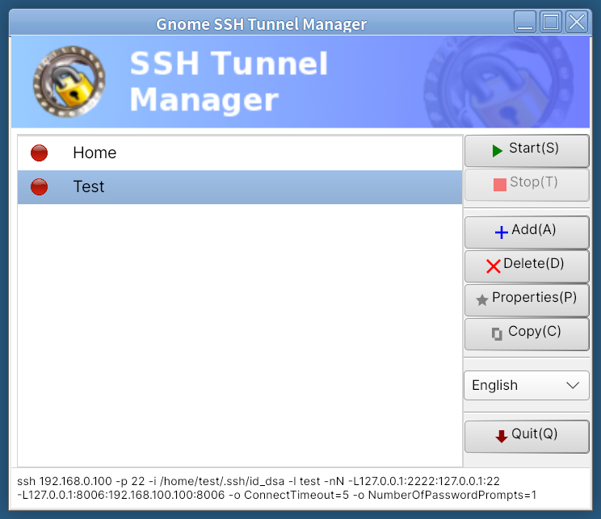
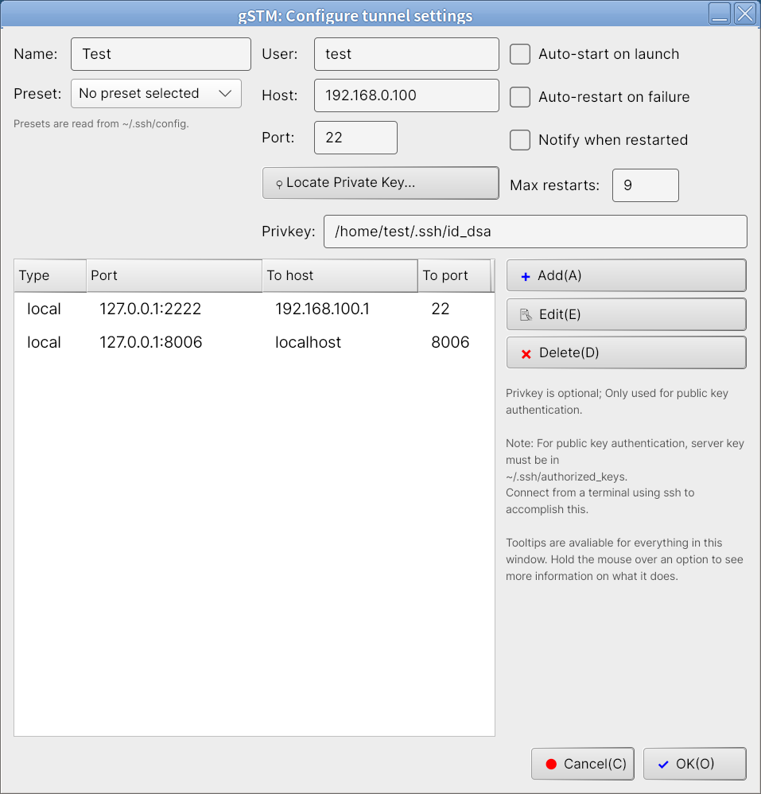
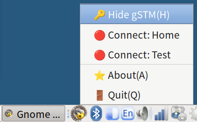

# gSTM - Gnome SSH Tunnel Manager


---

## .NET Edition

This is a .NET 10 + AvaloniaUI port of [gSTM](https://github.com/dallenwilson/gstm), based on v1.3.7 (GTK3 edition) available at: https://github.com/dallenwilson/gstm

Dependencies on GTK and platform-specific libraries have been removed in favor of cross-platform .NET and AvaloniaUI frameworks.

## .NET 版本

這是 [gSTM](https://github.com/dallenwilson/gstm) 的 .NET 10 + AvaloniaUI 移植版本，基於 v1.3.7 (GTK3 版本)。

已移除對 GTK 和平台特定函式庫的依賴，改為使用跨平台的 .NET 和 AvaloniaUI 框架。

---

## About gSTM

gSTM is a simple front-end to OpenSSH, built to make managing port-forwarding tunnels a little bit easier. Usage and configuration should be fairly straightforward. Errors generated by ssh are caught and displayed, and an SSH_ASKPASS-compatible program (dot-gstm-askpass) is provided for use with password authentication. See the OpenSSH manual for details on SSH_ASKPASS.

This .NET edition refactors gSTM-1.3.7 and maintains 100% configuration file compatibility while bringing native support for Linux and macOS, with Windows support untested.

## 關於 gSTM

gSTM 是 OpenSSH 的簡易前端介面，旨在讓 SSH 通道（port-forwarding tunnels）的管理更加容易。使用方式和設定應該相當直觀。SSH 產生的錯誤會被捕捉並顯示，並提供 SSH_ASKPASS 相容的程式（dot-gstm-askpass）用於密碼驗證。詳情請參閱 OpenSSH 手冊中關於 SSH_ASKPASS 的說明。

此 .NET 版本重構 gSTM-1.3.7 並維持 100% 設定檔相容性，同時原生支援 Linux 和 macOS，Windows 支援尚未測試。

---

## Features

- Simple graphical interface for SSH tunnel management
- Support for Local (-L), Remote (-R), and Dynamic (-D SOCKS) port forwarding
- Automatic tunnel restart on connection failure with configurable retry limits
- System tray integration for background operation
- Auto-start tunnels on application launch
- SSH config file (~/.ssh/config) preset support
- Desktop notification system
- Multi-language support (English, Traditional Chinese, Simplified Chinese, Japanese, Korean)
- Included `dot-gstm-askpass` utility for password authentication
- 100% configuration file compatibility with original gSTM

## 功能特色

- 簡潔的 SSH 通道管理圖形介面
- 支援本地（-L）、遠端（-R）和動態（-D SOCKS）通道轉發
- 連線失敗時自動重啟通道，可設定重試次數上限
- 系統托盤整合，支援背景執行
- 應用程式啟動時自動啟動指定通道
- 支援 SSH 設定檔（~/.ssh/config）預設組態
- 桌面通知系統
- 多語言支援（英文、繁體中文、簡體中文、日文、韓文）
- 內建 `dot-gstm-askpass` 工具用於密碼驗證
- 與原始 gSTM 100% 設定檔相容

---

## Important Usage Notes

⚠️ **Before Using gSTM**

Ensure your SSH connection is in good working order prior to setting up a new tunnel in gSTM. A good way of doing this is to run a quick test from a terminal first:

```bash
ssh -p portnumber username@host
```

⚠️ **First Connection Warning**

The first connection to a new, previously-unseen SSH server that is configured for pubkey authentication will cause ssh to display the server key and prompt the user to accept it. **This is not detectable by gSTM**, and the tunnel will appear to be connected but hang indefinitely. To avoid this, check your SSH connection as described above.

## 重要使用注意事項

⚠️ **使用 gSTM 之前**

在 gSTM 中設定新通道之前，請確保您的 SSH 連線狀態良好。建議先在終端機中進行快速測試：

```bash
ssh -p portnumber username@host
```

⚠️ **首次連線警告**

首次連線到新的、先前未見過且配置為公鑰驗證的 SSH 伺服器時，ssh 會顯示伺服器金鑰並提示使用者接受。**gSTM 無法偵測此情況**，通道會顯示為已連線但會無限期掛起。為避免此問題，請如上述方式檢查您的 SSH 連線。

---

## Screenshots







## 螢幕截圖

請參閱上方 Screenshots 部分。

---

## System Requirements

**Required:**
- .NET 10 Runtime ([Download](https://dotnet.microsoft.com/download/dotnet/10.0))
- OpenSSH client (`ssh` command available in PATH)

**Recommended:**
- Desktop environment with system tray support

**Operating Systems:**
- **Linux**: Any distribution with .NET 10 support ✅
- **macOS**: macOS 11.0 (Big Sur) or later ✅
- **Windows**: ⚠️ Untested

## 系統需求

**必要條件：**
- .NET 10 Runtime（[下載](https://dotnet.microsoft.com/download/dotnet/10.0)）
- OpenSSH 客戶端（`ssh` 指令需在 PATH 中可用）

**建議配置：**
- 支援系統托盤的桌面環境

**作業系統：**
- **Linux**：任何支援 .NET 10 的發行版 ✅
- **macOS**：macOS 11.0（Big Sur）或更新版本 ✅
- **Windows**：⚠️ 未測試

---

## Packaging & Releases (ToDo)

## 打包與發行 (ToDo)

---

## Building from Source

If you're building from a release tarball or git clone, you'll need .NET 10 SDK. Run the following commands:

```bash
# Build dot-gstm-askpass first (required for SSH password prompts)
# 先建置 dot-gstm-askpass（SSH 密碼提示需要）
dotnet publish -c Release -r linux-x64 --self-contained src/DotGstm.Askpass
# Copy to system path
# 複製到系統路徑
sudo cp src/DotGstm.Askpass/bin/Release/net10.0/linux-x64/publish/dot-gstm-askpass /usr/local/bin/
sudo chmod +x /usr/local/bin/dot-gstm-askpass

# Build and run main application
# 建置並執行主程式
dotnet restore
dotnet build
dotnet run --project src/DotGstm.Desktop
```

Publishing self-contained executables for distribution:

```bash
# Linux x64
dotnet publish -c Release -r linux-x64 --self-contained

# Windows x64 (Untested)
# Windows x64（未測試）
dotnet publish -c Release -r win-x64 --self-contained

# macOS x64 / ARM64
dotnet publish -c Release -r osx-x64 --self-contained
dotnet publish -c Release -r osx-arm64 --self-contained
```

The executables will be located in `src/DotGstm.Desktop/bin/Release/net10.0/{runtime}/publish/`

## 從原始碼建置

若您從發行版壓縮檔或 git clone 建置，需要 .NET 10 SDK。執行以下指令：

```bash
# 先建置 dot-gstm-askpass（SSH 密碼提示需要）
dotnet publish -c Release -r linux-x64 --self-contained src/DotGstm.Askpass
# 複製到系統路徑
sudo cp src/DotGstm.Askpass/bin/Release/net10.0/linux-x64/publish/dot-gstm-askpass /usr/local/bin/
sudo chmod +x /usr/local/bin/dot-gstm-askpass

# 建置並執行主程式
dotnet restore
dotnet build
dotnet run --project src/DotGstm.Desktop
```

發布自包含可執行檔用於分發：

```bash
# Linux x64
dotnet publish -c Release -r linux-x64 --self-contained

# Windows x64（未測試）
dotnet publish -c Release -r win-x64 --self-contained

# macOS x64 / ARM64
dotnet publish -c Release -r osx-x64 --self-contained
dotnet publish -c Release -r osx-arm64 --self-contained
```

可執行檔將位於 `src/DotGstm.Desktop/bin/Release/net10.0/{runtime}/publish/`

---

## Installing OpenSSH (Windows Users) (Untested)

Windows 10/11 includes OpenSSH as an optional feature:

1. Open **Settings** > **Apps** > **Optional Features**
2. Click **Add a feature**
3. Search for "OpenSSH Client"
4. Click **Install**

Alternatively, verify installation via PowerShell:
```powershell
ssh -V
```

## 安裝 OpenSSH（Windows 使用者）（未測試）

Windows 10/11 包含 OpenSSH 作為選用功能：

1. 開啟**設定** > **應用程式** > **選用功能**
2. 點選**新增功能**
3. 搜尋「OpenSSH Client」
4. 點選**安裝**

或者，透過 PowerShell 驗證安裝：
```powershell
ssh -V
```

---

## Usage Guide

### Basic Operations

1. **Add a New Tunnel**
   - Click the **Add** button
   - Fill in tunnel name, host, port, username, and optional private key path
   - Add port forwarding rules

2. **Configure Port Forwarding**
   - In the Properties dialog, click **Add** under "Port Redirections"
   - Select forwarding type: Local, Remote, or Dynamic
   - Specify ports and target host

3. **Start/Stop Tunnels**
   - Select a tunnel from the list
   - Click **Start** to establish the connection
   - Click **Stop** to terminate the tunnel
   - Or double-click a tunnel to toggle its state

4. **System Tray Integration**
   - Minimize to tray to keep tunnels running in background
   - Right-click tray icon to quickly start/stop tunnels

### Example: Local Port Forwarding

Forward local port 8080 to remote server's port 80:

1. **Name**: `Web Server Tunnel`
2. **Host**: `example.com`
3. **Port**: `22`
4. **User**: `your-username`
5. **Private Key**: `~/.ssh/id_rsa` (optional)
6. **Port Redirection**:
   - Type: `Local`
   - Port1: `127.0.0.1:8080`
   - Host: `localhost`
   - Port2: `80`

After starting the tunnel, access `http://localhost:8080` to connect to the remote port 80.

### Using SSH Config Presets

If you have hosts defined in `~/.ssh/config`, you can use them directly:

1. In the Properties dialog, select a host from the **SSH Preset** dropdown
2. User, host, port, and key settings will be auto-populated
3. Manual fields will be disabled when using a preset

## 使用指南

### 基本操作

1. **新增通道**
   - 點選**新增**按鈕
   - 填寫通道名稱、主機、通訊埠、使用者名稱和選填的私鑰路徑
   - 新增通道轉發規則

2. **設定通道轉發**
   - 在屬性對話框中，點選「通道轉發」下的**新增**
   - 選擇轉發類型：本地、遠端或動態
   - 指定通訊埠和目標主機

3. **啟動/停止通道**
   - 從清單中選擇通道
   - 點選**啟動**建立連線
   - 點選**停止**終止通道
   - 或雙擊通道以切換其狀態

4. **系統托盤整合**
   - 最小化至托盤以保持通道在背景執行
   - 右鍵點選托盤圖示可快速啟動/停止通道

### 範例：本地通道轉發

將本地通訊埠 8080 轉發到遠端伺服器的通訊埠 80：

1. **名稱**：`Web Server Tunnel`
2. **主機**：`example.com`
3. **通訊埠**：`22`
4. **使用者**：`your-username`
5. **私鑰**：`~/.ssh/id_rsa`（選填）
6. **通道轉發**：
   - 類型：`本地`
   - Port1：`127.0.0.1:8080`
   - 主機：`localhost`
   - Port2：`80`

啟動通道後，存取 `http://localhost:8080` 即可連線到遠端的 80 通訊埠。

### 使用 SSH 設定檔預設組態

如果您在 `~/.ssh/config` 中定義了主機，可以直接使用：

1. 在屬性對話框中，從 **SSH Preset** 下拉選單選擇主機
2. 使用者、主機、通訊埠和金鑰設定將自動填入
3. 使用預設組態時，手動欄位將被停用

---

## Configuration Files

### Location

dot-gSTM configuration files are stored in platform-specific locations:

- **Linux/macOS**: `~/.config/gSTM/`
- **Windows**: `%APPDATA%\gSTM\`

Each tunnel is saved as an individual XML file: `{TunnelName}.{RandomID}.gstm`

### Migrating from gSTM

dot-gSTM is **100% compatible** with original gSTM configuration files. No conversion needed!

**For Linux/macOS users:**
```bash
# Your existing gSTM tunnels should be in:
# 您現有的 gSTM 通道應位於：
ls ~/.config/gSTM/

# dot-gSTM will automatically load them
# dot-gSTM 將自動載入它們
# Both gSTM and dot-gSTM can be installed simultaneously
# gSTM 和 dot-gSTM 可同時安裝
```

**For Windows users migrating from Linux:**
```bash
# Copy your gSTM config files to Windows:
# 將您的 gSTM 設定檔複製到 Windows：
# From: ~/.config/gSTM/*.gstm
# To: %APPDATA%\gSTM\
```

### Configuration File Format

Example XML structure (`MyTunnel.ABC123.gstm`):

```xml
<?xml version="1.0"?>
<sshtunnel>
  <name>MyTunnel</name>
  <host>example.com</host>
  <port>22</port>
  <login>user</login>
  <privkey>/home/user/.ssh/id_rsa</privkey>
  <autostart>0</autostart>
  <restart>1</restart>
  <notify>1</notify>
  <maxrestarts>9</maxrestarts>
  <preset>0</preset>
  <tunnel>
    <type>local</type>
    <port1>127.0.0.1:8080</port1>
    <host>localhost</host>
    <port2>80</port2>
  </tunnel>
</sshtunnel>
```

## 設定檔

### 位置

dot-gSTM 設定檔儲存於平台特定位置：

- **Linux/macOS**：`~/.config/gSTM/`
- **Windows**：`%APPDATA%\gSTM\`

每個通道儲存為獨立的 XML 檔案：`{TunnelName}.{RandomID}.gstm`

### 從 gSTM 遷移

dot-gSTM 與原始 gSTM 設定檔 **100% 相容**。無需轉換！

**Linux/macOS 使用者：**
```bash
# 您現有的 gSTM 通道應位於：
ls ~/.config/gSTM/

# dot-gSTM 將自動載入它們
# gSTM 和 dot-gSTM 可同時安裝
```

**從 Linux 遷移至 Windows 的使用者：**
```bash
# 將您的 gSTM 設定檔複製到 Windows：
# 來源：~/.config/gSTM/*.gstm
# 目標：%APPDATA%\gSTM\
```

### 設定檔格式

XML 結構範例（`MyTunnel.ABC123.gstm`）：

```xml
<?xml version="1.0"?>
<sshtunnel>
  <name>MyTunnel</name>
  <host>example.com</host>
  <port>22</port>
  <login>user</login>
  <privkey>/home/user/.ssh/id_rsa</privkey>
  <autostart>0</autostart>
  <restart>1</restart>
  <notify>1</notify>
  <maxrestarts>9</maxrestarts>
  <preset>0</preset>
  <tunnel>
    <type>local</type>
    <port1>127.0.0.1:8080</port1>
    <host>localhost</host>
    <port2>80</port2>
  </tunnel>
</sshtunnel>
```

---

## Development

### Project Structure

```
dot-gstm/
├── src/
│   ├── DotGstm.Desktop/        # Main AvaloniaUI application
│   │   ├── Models/             # Data models (SshTunnel, PortRedirection)
│   │   ├── Services/           # Business logic (SSH, Config, Tray)
│   │   ├── Views/              # AXAML UI files
│   │   ├── ViewModels/         # MVVM view models
│   │   ├── Assets/             # Images, styles
│   │   └── Resources/          # Localization resources
│   └── DotGstm.Askpass/        # SSH_ASKPASS standalone program
├── tests/
│   └── DotGstm.Tests/          # Unit tests
├── docs/
│   ├── ARCHITECTURE.md         # Architecture documentation
│   ├── FAITHFUL_PORT.md        # Porting guidelines
│   ├── Internationalization-Plan.md
│   └── gSTM-DotGSTM-Function-Mapping-*.md
├── Referances/                 # Original gSTM source code
│   ├── gstm-1.2/               # gSTM version 1.2 (GTK2)
│   └── gstm-forked-gtk3/       # gSTM version 1.3.x (GTK3)
└── README.md
```

### Technology Stack

| Component | Technology |
|-----------|-----------|
| Framework | .NET 10 |
| UI | AvaloniaUI 11.x |
| MVVM | ReactiveUI |
| XML Processing | System.Xml.Linq |
| Process Management | System.Diagnostics.Process |
| Localization | .NET Resources (.resx) |

### Build Commands

```bash
# Restore dependencies
# 還原相依性
dotnet restore

# Build
# 建置
dotnet build

# Run
# 執行
dotnet run --project src/DotGstm.Desktop

# Run tests
# 執行測試
dotnet test

# Publish for distribution
# 發布用於分發
dotnet publish -c Release -r linux-x64 --self-contained
dotnet publish -c Release -r win-x64 --self-contained
dotnet publish -c Release -r osx-x64 --self-contained
dotnet publish -c Release -r osx-arm64 --self-contained
```

### Code Architecture

dot-gSTM faithfully replicates gSTM's architecture while adapting to .NET patterns.

For detailed code comparison and mapping, see [gSTM-1.3.7-vs-dot-gSTM-1.4.0-Complete-Comparison-2026-01-01.md](docs/gSTM-1.3.7-vs-dot-gSTM-1.4.0-Complete-Comparison-2026-01-01.md)

Quick reference table:

| gSTM (C) | dot-gSTM (C#) | Purpose |
|----------|---------------|---------|
| `fnssht.c` | `SshService.cs` | SSH tunnel start/stop operations |
| `conffile.c` | `ConfigService.cs` | XML-based tunnel configuration I/O |
| `systray.c` | `TrayIconService.cs` | System tray integration |
| `gstm.c` | `MainWindow.axaml.cs` | Main window management |
| `callbacks.c` | Event handlers in ViewModels | UI event handling |
| `struct sshtunnel` | `SshTunnel` class | Tunnel configuration model |
| `struct portredir` | `PortRedirection` class | Port forwarding definition |

## 開發

### 專案結構

（同上方英文結構圖）

### 技術堆疊

| 元件 | 技術 |
|------|------|
| 框架 | .NET 10 |
| UI | AvaloniaUI 11.x |
| MVVM | ReactiveUI |
| XML 處理 | System.Xml.Linq |
| 程序管理 | System.Diagnostics.Process |
| 本地化 | .NET Resources (.resx) |

### 建置指令

（同上方英文指令，已含中文註解）

### 程式碼架構

dot-gSTM 忠實複製 gSTM 的架構，同時適應 .NET 模式。

詳細程式碼對照與對應請參閱 [gSTM-1.3.7-vs-dot-gSTM-1.4.0-完整對照-2026-01-01.md](docs/gSTM-1.3.7-vs-dot-gSTM-1.4.0-完整對照-2026-01-01.md)

快速參考表：

| gSTM (C) | dot-gSTM (C#) | 用途 |
|----------|---------------|------|
| `fnssht.c` | `SshService.cs` | SSH 通道啟動/停止操作 |
| `conffile.c` | `ConfigService.cs` | 基於 XML 的通道設定檔 I/O |
| `systray.c` | `TrayIconService.cs` | 系統托盤整合 |
| `gstm.c` | `MainWindow.axaml.cs` | 主視窗管理 |
| `callbacks.c` | ViewModels 中的事件處理器 | UI 事件處理 |
| `struct sshtunnel` | `SshTunnel` 類別 | 通道設定模型 |
| `struct portredir` | `PortRedirection` 類別 | 通道轉發定義 |

---

## Internationalization

dot-gSTM supports multiple languages out of the box:

| Language | Code |
|----------|------|
| English | en-US |
| Traditional Chinese | zh-TW |
| Simplified Chinese | zh-CN |
| Japanese | ja-JP |
| Korean | ko-KR |

The application automatically detects your system language. To manually override, set the `LANG` environment variable before launching.

## 國際化

dot-gSTM 內建支援多種語言：

| 語言 | 代碼 |
|------|------|
| 英文 | en-US |
| 繁體中文 | zh-TW |
| 簡體中文 | zh-CN |
| 日文 | ja-JP |
| 韓文 | ko-KR |

應用程式會自動偵測您的系統語言。若要手動覆寫，請在啟動前設定 `LANG` 環境變數。

---

## License

This program is free software; you can redistribute it and/or modify it under the terms of the **GNU General Public License version 2** as published by the Free Software Foundation.

This program is distributed in the hope that it will be useful, but **WITHOUT ANY WARRANTY**; without even the implied warranty of MERCHANTABILITY or FITNESS FOR A PARTICULAR PURPOSE. See the GNU General Public License for more details.

You should have received a copy of the GNU General Public License along with this program. If not, see <http://www.gnu.org/licenses/>.

**Note**: This project continues the GPL-2.0 license from the original gSTM project.

## 授權條款

本程式為自由軟體；您可以依據自由軟體基金會發布的 **GNU 通用公共授權條款第 2 版**重新散布或修改本程式。

本程式的發布是希望它能有用，但**不提供任何保證**；甚至不提供適售性或特定目的適用性的默示保證。詳情請參閱 GNU 通用公共授權條款。

您應該已經隨本程式收到 GNU 通用公共授權條款的副本。若無，請參閱 <http://www.gnu.org/licenses/>。

**說明**：本專案延續原始 gSTM 專案的 GPL-2.0 授權條款。

---

## Copyright

- **dot-gSTM (.NET Port)**: Copyright (c) 2026 dot-gSTM Contributors
- **Original gSTM**: Copyright (c) 2005-2020 Mark Smulders <msmulders@elsar.nl>
- **gSTM GTK3 Port**: Copyright (c) 2019-2020 Dallen Wilson <dwjwilson@lavabit.com>

## 版權聲明

- **dot-gSTM（.NET 移植版）**：Copyright (c) 2026 dot-gSTM Contributors
- **原始 gSTM**：Copyright (c) 2005-2020 Mark Smulders <msmulders@elsar.nl>
- **gSTM GTK3 移植版**：Copyright (c) 2019-2020 Dallen Wilson <dwjwilson@lavabit.com>

---

## Credits and Acknowledgments

- **Mark Smulders** - Original gSTM author
- **Dallen Wilson** - GTK3 port maintainer
- **gSTM Contributors** - All contributors to the original project
- **AvaloniaUI Team** - For the excellent cross-platform UI framework
- **.NET Team** - For the modern, performant runtime

## 致謝

- **Mark Smulders** - 原始 gSTM 作者
- **Dallen Wilson** - GTK3 移植版維護者
- **gSTM 貢獻者** - 所有原始專案的貢獻者
- **AvaloniaUI 團隊** - 提供優秀的跨平台 UI 框架
- **.NET 團隊** - 提供現代化、高效能的執行階段

---

## Related Links

- [Original gSTM (GTK3)](https://github.com/dallenwilson/gstm)
- [AvaloniaUI Framework](https://avaloniaui.net/)
- [.NET Download](https://dotnet.microsoft.com/download)

## 相關連結

- [原始 gSTM（GTK3）](https://github.com/dallenwilson/gstm)
- [AvaloniaUI 框架](https://avaloniaui.net/)
- [.NET 下載](https://dotnet.microsoft.com/download)
